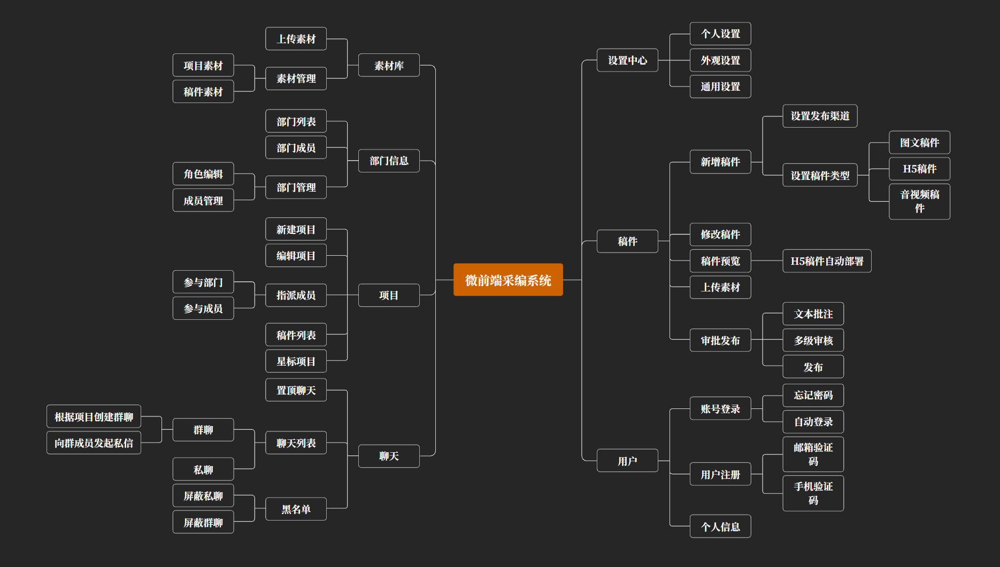
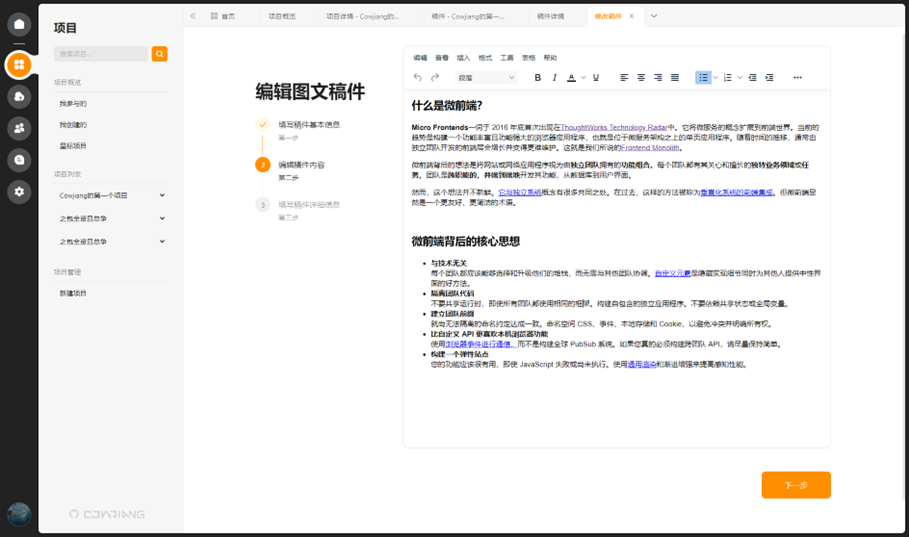

# 基于微前端的多媒体采编系统

基于 Wujie Micro、UmiJS、React、Vue、Ant Design 5、Vuetify 3 的多媒体采编系统

## 概述

由于当今互联网的高速发展，媒体融合时代也随之到来，新闻媒体的传播方式不再仅限于传统的纸质媒体，而是更多地应用并传播于互联网、数字报、手机报、触摸屏等媒介。在此背景下，新一代的多媒体采编系统必须扎根于互联网技术，提高媒体内容的复用性，减少人力、物力、财力，实现稿件和素材的采集、处理、审批及外网发布的全过程，集中管理工作中产生的多媒体素材，减少并优化各个工作环节，提高工作效率，加强宣传的时效性和交互性。本系统基于上述背景，设计稿件编辑与审批、素材管理、实时通讯、角色权限管理等功能，构建一个高效、易扩展的采编系统。

## 开发技术

```
开发语言： Typescript
微前端框架： Wujie Micro
开发框架： React、Umi、Vue
UI框架： Ant Design、Vuetify
状态管理工具： Dva、Pinia
实时通信工具： Socket.io
样式方案： Tailwind、Less、Scss
可视化图表： Echarts
构建工具： Webpack、Vite
```

## 系统功能



## 系统特色

* 微前端架构
* 双 Token 认证与刷新
* 基于请求路径和路由的权限拦截
* H5自动部署与预览
* 实时通信与数据流
* 动态主题与微应用间的主题同步
* OSS对象存储与服务端签名
* 标签页与状态管理

## 视频演示

[哔哩哔哩 - 演示视频](https://www.bilibili.com/video/BV1wT411s7Cn)

## 效果速览





